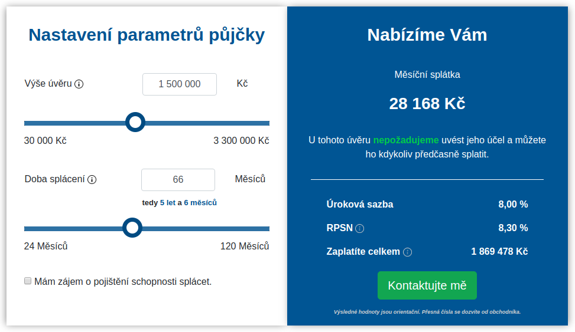

# TrasKalkulačka

Nejlepší úvěrová kalkulačka na světě vyvíjená pro Tatrask banku


## Odkazy
[Testovací prostředí](https://petrnovak96.github.io)

[SD OneDrive](https://onedrive.live.com/?authkey=%21AOwb0pPkxexMT2Q&id=7D8ADDAA7DD1D2F2%21206754&cid=7D8ADDAA7DD1D2F2)

[SD Google sheet](https://docs.google.com/spreadsheets/d/1VY2zbDqbavT3gcQdxqk1Drbregrhx6qyBpgRohd8NYE/edit#gid=1968327993)

[SD Google Drive](https://drive.google.com/drive/folders/12UncPkR1gI0kd1vPT5OTzXAkHB4UOr1E?fbclid=IwAR0S2bmt5qMTp1WMNgDREhjAEsntr1DGweVr7Lm3tkgcC-EEe9thVo3kddU)
## Pokyny pro stáhnutí a zprovoznění
_Předpokládá se, že máš nainstalovaný git, nodejs a npm._
* na příkazové řádce přejdi do složky, ve které chceš mít projekt
```
cd <absolutní cesta ke složce>
```
* vytvoř složku api_code_generator
```
mkdir api_code_generator
```
* do této složky rozbal obsah [zipu](https://drive.google.com/drive/folders/1eGnRHV7FwzU6C6XqZkEYgUcT7lAFdLIy).

* vytvoř složku bankovni_server
```
mkdir bankovni_server
```
* do této složky rozbal obsah [zipu](https://drive.google.com/file/d/1c_RWQvoZanvMAvI2HrbwX6NzZZkI5GV6/view).

* na příkazové řádce ve složce **bankovni_server** spusť a nech běžet:
```
npm start
```

* na příkazové řádce v této složce napiš
```
git clone https://github.com/PetrNovak96/TrasKalkulacka
```
* přesuň se do nové složky
```
cd TrasKalkulacka
```
* potom zadej
```
npm install
```
* a potom zadej
```
npm start
```
* klient potom běží na ```http:localhost:4200/```
